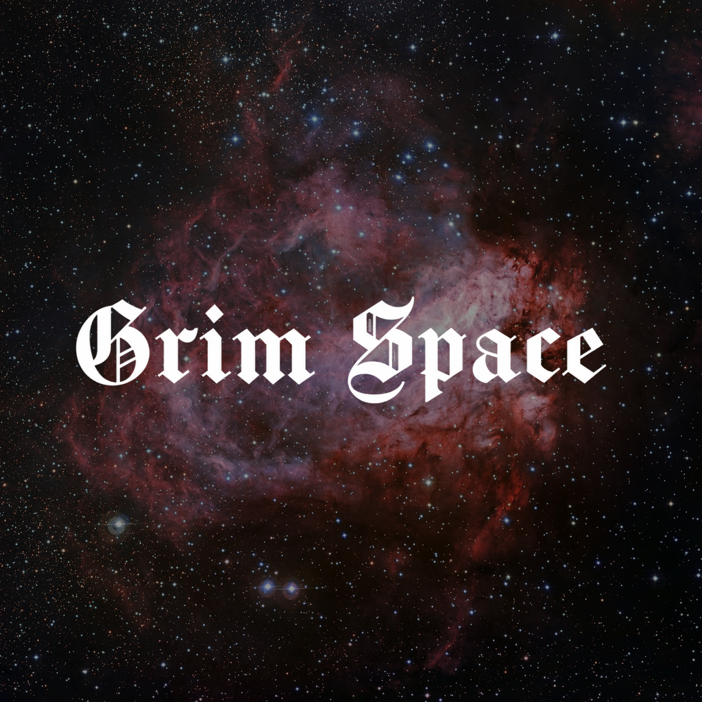

<div align="center">
  
</div>

# grim-space

Early-stage 3D roguelike space game with strategic star-system navigation and tactical turn-based combat on a discrete 3D grid.

Gameplay systems in code come first — placeholder visuals, APIs that change, and design details still being proven out.

## Game architecture and boundaries

The game uses one-way command flow into the simulation and derived presentation flow back out:

```text
Godot input
    → view / HUD
    → user-intent translator
    → IActionSink / player execution agent
    → simulation proposal
    → ActionBatch
    → subsystem orchestrator
    → Engine.Commit
    → live world + runtime + timeline
    → presentation frame / replay / synchronized views
    → view / HUD
```

| Layer | Owns | Boundary |
|-------|------|----------|
| **View / HUD** | Godot nodes, rendering, widgets, animation, and raw input events | Displays supplied state and emits interaction events; never changes game state |
| **User-intent translation** | Converting clicks, keys, picks, and UI choices into domain-level action requests | Targets `IActionSink` or another narrow execution-agent API; never decides final legality |
| **Execution agent** | One actor's planning lifecycle and proposed actions | Produces and publishes an action batch; simulation-backed agents validate on a fork; agents never commit |
| **Subsystem orchestrator** | Mode/phase, actor activation, batch ordering, tick advancement, and world-update notifications | The only layer allowed to move accepted proposals into the engine |
| **Domain rules** | World/runtime types, actions, effects, legality, objectives, and other game-specific policy | Must not depend on Godot or presentation |
| **Generic kernel** | Forking, preview, commit, timeline, listeners, and generic search | Must not depend on game-specific domains |

[`UserIntentTranslator`](src/battle/presentation/scene/UserIntentTranslator.cs) and its [star-map counterpart](src/world/star-system/presentation/UserIntentTranslator.cs) are input boundaries, not rule owners. They may translate screen-space picks into domain coordinates or targets and request an action, but action definitions and the execution agent remain responsible for legality. A disabled button or missing highlight is never proof that an action is illegal.

Application controls such as pause, step, speed, scene navigation, and camera movement may call narrow presentation or orchestrator APIs directly because they do not represent an actor's domain action. They still must not mutate world objects.

### State authority

| State | Authority |
|-------|-----------|
| **Live world** | Authoritative current game state: units, positions, resources, contracts, objectives, hazards, and similar domain facts |
| **Live actor runtime** | Authoritative transient rule state owned beside the world by the engine |
| **Live timeline** | Authoritative committed order, delayed actions, and emitted facts; it is history, not a duplicate current-state model |
| **Simulation** | Non-authoritative proposal derived from a live-state fork |
| **Presentation frame / view model** | Disposable projection derived from live state, the active simulation, or replay data |
| **Godot node state** | Rendering and interaction state only |

UI state should be derived from the current world, active simulation, and committed timeline whenever practical. Acceptable local UI state includes focus, hover, selected tab, open overlays, camera pose, drag state, animation progress, and short-lived visual caches. Gameplay facts such as health, position, resources, action points, cooldowns, turn phase, contracts, objectives, and pending domain actions belong to the world/runtime or execution agent and must not be duplicated as independent UI truth.

Presentation may temporarily differ from the live world while showing a planning preview, interpolation, or replay. That state must remain explicitly derived and disposable: completing or canceling the presentation returns to a fresh projection of authoritative state. Rendered node transforms, visibility, labels, and animation state must never feed back into rule evaluation.

### Application seam (`Session`) and run coordination

Godot scenes come and go; tactical battle and the star-system map each own an orchestrator and a live world. [`Session`](src/application/Session.cs) is the **application seam**: a thin autoload that bootstraps logging and settings, holds the current run handle, preloads scenes, navigates between `map.tscn` and `battle.tscn`, and exposes dev tooling. It is **not** where cross-world gameplay rules or simulation commits live.

Run-scoped coordination lives in [`Run.State`](src/run/State.cs). That type is the shared “glue” for one roguelike run: party and tutorial progress, the active [`StarSystemOrchestrator`](src/world/star-system/StarSystemOrchestrator.cs), optional strategic [`ActiveBattle`](src/battle/encounter/BattleEncounter.cs), pending outcomes, map regeneration, and [`RunTransitionInbox`](src/run/RunTransitionInbox.cs) (buffered star-system resource notifications that must survive scene changes). `CreateNewRun` returns a fully wired instance—subscriptions included—so background-prepared runs do not need extra binding after adoption.

| Component | Owns | Must not |
|-----------|------|----------|
| **`Session`** | Current `Run` adoption/disposal, `BattleReady` → deferred scene change, menu startup, scene preload, dev menu | Query engagement state, build encounters, subscribe to battle/star-system engine listeners, or mutate strategic worlds |
| **`Run.State`** | Orchestrator lifecycle, engine listener subscriptions, run facts (`ActiveBattle`, `PendingBattleOutcome`), inbox binding | Godot nodes, input, or rendering |

#### Records and listeners into shared run state

Subsystem boundaries are crossed with **committed facts**, not with action types. Actions express actor intent (`EngageAction`, `CommitBattleOutcomeAction`, …). Effects apply mutations and may emit [`Record<T>`](src/core/timeline/IRecord.cs) values that describe what **definitively happened** after commit—engagement identity, battle outcome, loot transactions, and similar. [`Engine.Subscribe<TEntry>`](src/core/engine/Engine.cs) delivers those entries only from **live** commits; simulation preview does not notify subscribers.

`Run.State` subscribes to orchestrators and updates **run-level** state in small handlers. It does not replace effects or duplicate world authority: handlers call existing orchestrator APIs (for example `StarSystem.ResolveEngagement`) and set run fields such as `ActiveBattle` or clear them after success.

```text
Star map: EngageAction committed
    → CommitEngagementEffect
    → Record<EngagementCommitted> on live timeline
    → Run.State listener (player participant, dedupe by engagement id)
    → EngagementBattleFactory → ActiveBattle
    → BattleReady event
    → Session → battle.tscn

Battle: terminal outcome committed
    → CommitBattleOutcomeEffect
    → Record<BattleOutcome> on live timeline
    → Run.State listener (via battle orchestrator subscription)
    → StarSystem.ResolveEngagement → ActiveBattle cleared
    → presentation may return to map when ActiveBattle is null
```

Prefer **records over actions** when the consumer needs resolved identity or outcome payload. Example: do not subscribe to `EngageAction` to start a battle—the action does not carry the committed engagement id; subscribe to `Record<EngagementCommitted>` emitted by the effect instead.

Presentation scenes stay thin. [`MapController`](src/world/star-system/presentation/MapController.cs) enqueues domain actions and binds HUD feeds to `Run.Transitions`; it does not construct battles or drive scene transitions. [`BattleController`](src/battle/presentation/scene/BattleController.cs) asks `Run.State` for `CreateActiveBattleOrchestrator()` on the strategic path (outcome subscription is already on the run) or builds a dev-only encounter with no `ActiveBattle`. Dev duel explicitly bypasses strategic run state.

When replacing or regenerating a star-system, `Run.State` disposes old engine subscriptions and rebinds the inbox so listeners do not leak across maps. `Session` only unsubscribes from `BattleReady`, disposes the previous run, assigns the new run, and resubscribes—no special-case wiring for prepared runs.

### Rules for contributors and agents

- **MUST** send user-originated gameplay actions through intent translation and an execution agent; never mutate world objects from UI code.
- **MUST** implement legality in action definitions. UI may explain or pre-filter choices but must not own a parallel legality rule.
- **MUST** rebuild or synchronize presentation after authoritative state changes instead of incrementally maintaining a second game model.
- **MUST** key derived caches by the relevant tick, `WorldVersion`, or source identity and invalidate them when that source changes.
- **MUST** keep UI-only state semantically irrelevant to simulation outcomes.
- **MUST** use committed actions/records or explicit world-update notifications to trigger presentation refreshes; listeners must not perform domain mutation.
- **MUST NOT** read gameplay truth from Godot nodes, rendered transforms, labels, button state, or animation progress.
- **MUST NOT** let domain, engine, action, or effect code depend on presentation types.
- Temporary exceptions must be marked as boundary leaks and must not become dependencies for new code.

## Generic simulation kernel

`src/core/actions/`, `src/core/engine/`, `src/core/timeline/`, and `src/core/dfs/` form a domain-agnostic, Godot-free kernel. Tactical battle and the strategic star-system are two consumers, not concepts built into the kernel.

Domain independence is an architectural requirement. The kernel must remain usable by plain .NET code for non-game workflows that fit its action/effect/timeline model. It must not reference Godot, scenes, presentation, or grim-space domains such as battles, fleets, contracts, and units. Consumers provide their world, runtime, actions, effects, and policies through the generic contracts; integration with Godot belongs outside the kernel.

### Canonical ownership

| Owner | Responsibility | Must not |
|-------|----------------|----------|
| [`Engine<TWorld, TRuntime>`](src/core/engine/Engine.cs) | Owns the live world, live actor runtimes, `WorldVersion`, commits, scheduling, timeline advancement, and listeners | Plan actions or contain game-specific rules |
| [`Simulation<TWorld, TRuntime>`](src/core/engine/Simulation.cs) | Owns a forked planning world/runtime, proposed actions, preview effects, and undo state | Mutate the engine or append to its live timeline |
| [`ExecutionAgent<TWorld, TRuntime>`](src/core/engine/ExecutionAgent.cs) | Produces one actor's proposed `ActionBatch` when the orchestrator allows it to work | Commit actions or choose global execution order |
| Subsystem orchestrator | Activates agents, consumes batches, orders commits, advances ticks, and reports world updates | Reimplement action rules or mutate domain state directly |
| [`Timeline`](src/core/timeline/Timeline.cs) | Stores committed entries by tick and actions scheduled for future ticks | Act as a second world-state model |

Each rules system supplies:

- a durable `IWorld<TWorld>` containing its domain state and timeline;
- a resettable, forkable `IRuntimeContext<TRuntime>` for per-actor working state.

### Required execution flow

```text
live Engine
    → CreateSimulation() forks world + actor runtimes at Tick and WorldVersion
    → SimulationExecutionAgent plans against that fork
    → agent publishes ActionBatch through ActionBatchSink
    → subsystem orchestrator accepts and orders the batch
    → Engine.Commit resolves the actions against live state
    → effects mutate live world/runtime
    → actions + records are appended to the live timeline
    → WorldVersion increments and typed listeners run
    → orchestrator reports the world update; simulation-backed agents refork
```

The simulation action queue is a proposal, **not** timeline history. `Simulation.TryCommit` only returns that proposal; despite its name, it does not cross into live state. Only the orchestrator's call to `Engine.Commit` does that.

### Actions, effects, and records

| Type | Meaning | Authority |
|------|---------|-----------|
| **Action** ([`IAction`](src/core/actions/IAction.cs)) | An actor's intent, such as moving, firing, or accepting a contract | Identifies the actor and its definition; never mutates state |
| **Action definition** ([`IActionDef`](src/core/actions/IActionDef.cs)) | Rules for one action family | Discovers candidates, checks possibility/legality, and resolves an action into effects |
| **Effect** ([`IEffect`](src/core/actions/IEffect.cs)) | One atomic state transition | Mutates only the supplied world/runtime; supports undo when used in undoable planning |
| **Record** ([`IRecord`](src/core/timeline/IRecord.cs)) | A fact emitted by an effect, such as an impact, spawn, or transaction | Describes an outcome; never mutates state and is not a replay command |

One action may resolve to many effects; one effect may emit zero or more records:

```text
Action (what was attempted)
    → ActionDef.Resolve
    → Effects (what changes)
    → Records (what happened)
```

Simulation runs the same definitions and effects against forked state. Preview records stay inside that simulation and never enter the live timeline. During `Engine.Commit`, the engine resolves again against live state, then appends each action followed by its emitted records. Actions and records both implement `ITimelineEntry`.

### Typed listeners

[`Engine.Subscribe<TEntry>`](src/core/engine/Engine.cs) observes newly committed timeline entries:

- Matching uses the entry's **exact runtime type**; subscribing to a base type or interface does not receive derived entries.
- Both action types and record types can be observed.
- Callbacks run synchronously, in entry order, after the entire batch has mutated live state, entered history, and incremented `WorldVersion`.
- A callback sees the batch's final world state, not the intermediate state after its matching entry.
- Preview execution never notifies live listeners.
- `Schedule` does not notify. The action becomes observable when `AdvanceTick` commits it.
- There is no history replay for late subscribers.
- The returned subscription must be disposed with its owner.

Listeners must not become a second mutation path. They may update external presentation state or enqueue follow-up actions for the orchestrator, but should not edit the world directly or recursively call `Engine.Commit`. Listener exceptions propagate after the live commit has already occurred, so callbacks should remain small and reliable.

### Reusable kernel tools

These APIs are generic capabilities. Their current consumers do not limit where they may be reused.

#### Planning and queue tools

| Tool | Contract |
|------|----------|
| `Simulation.Peek(action)` | Applies one legal action to copies of the current preview world/runtime and returns a `PeekFrame` with projected state and records. It does not change the simulation or enqueue the action. |
| `Simulation.Fork()` | Creates an independent branch preserving the current proposed queue. Use for speculative branches. |
| `Simulation.ForkFromAnchor()` | Creates a clean branch from the simulation's original engine snapshot. |
| `Simulation.ReplayWorld(depth)` | Reconstructs world state from the anchor through a queue prefix without changing the simulation. |
| `Simulation.RecordsFor(index)` | Returns preview records retained for an action enqueued with `keepRecords: true`. |
| [`IActionInvariants`](src/core/actions/IActionInvariants.cs) | Evaluates whether the whole proposed sequence is `Ok`, `Incomplete`, or `Impossible`. This is separate from per-action legality. `TryCommit` accepts only `Ok`; planners may continue an `Incomplete` sequence and should prune an `Impossible` one. |
| [`IActionStreamline`](src/core/actions/IActionStreamline.cs) | Rewrites or compacts an action queue through a caller-provided legality predicate. It is a generic queue-normalization hook, not a battle rule. |
| [`IActionSink`](src/core/actions/IActionSink.cs) | Minimal enqueue/undo/commit interface for callers that should control planning without depending on a concrete execution agent. |

#### Actor and action-production tools

| Tool | Contract |
|------|----------|
| [`ActorRuntimes<TRuntime>`](src/core/engine/ActorRuntimes.cs) | Lazily owns runtime state by actor id and can fork or reset all registered runtimes. |
| [`EmptyRuntime`](src/core/engine/EmptyRuntime.cs) | Runtime implementation for systems that need no per-actor scratch state. |
| [`IActorStateWorld<TState, TWorld>`](src/core/engine/IActorStateWorld.cs) | Optional world capability enabling typed `Simulation.StateOf<TState>(actorId)` lookup. |
| [`ActionBatchSink`](src/core/engine/ActionBatchSink.cs) | Per-actor handoff between producers and orchestrators. Supports polling or async waiting and carries either a batch or a production failure. Each actor has one bounded latest-result slot, so a newer unread result replaces the older one. |
| `ExecutionAgent.SetCanWork` | Activation gate controlled by the orchestrator. At most one batch should be in flight for an activation. |
| `ExecutionAgent.OnWorldUpdated` | Refresh signal from the orchestrator. A `SimulationExecutionAgent` reforks and replans from current live state. |

#### Timeline tools

| Tool | Contract |
|------|----------|
| `Timeline.History(tick)` | Non-destructive read of committed entries for one tick. |
| `Timeline.HistoryByActor(tick)` | Non-destructive action-only view grouped by actor. Records are excluded. |
| `Timeline.DrainUntil(tick)` | Destructively removes and returns committed history through the supplied tick as `TimelineBatch` values. |
| `Timeline.Clone()` | Copies clock, pending actions, and history. |
| `Timeline.CloneSnapshot()` | Copies clock and pending actions but omits committed history; useful for simulation snapshots. |
| Timeline GC | `Engine` periodically removes old committed history according to `TimelineGcOptions`. It does not remove pending actions or mutate domain state. |

### Rules for contributors and agents

- **MUST** keep kernel packages free of Godot and grim-space domain dependencies.
- **MUST** express consumer-specific behavior through generic types, kernel interfaces, or code in the consuming system.
- **MUST NOT** place scene lifecycle, autoload, input, rendering, audio, or persisted Godot settings in the kernel.
- **MUST** mutate live domain objects, after engine construction, only through effects applied during `Engine.Commit`.
- **MUST** route post-construction timeline changes through `Engine.Commit`, `Engine.Schedule`, `Engine.AdvanceTick`, or an effect currently being applied by the engine. Direct timeline setup is reserved for world construction.
- **MUST NOT** let an execution agent or simulation call `Engine.Commit`.
- **MUST** keep action definitions deterministic for the supplied world/runtime.
- **MUST NOT** mutate live domain objects directly from an action, record, presentation listener, or orchestrator.
- **MUST** keep every effect's mutations inside the supplied world/runtime.
- **MUST** implement complete `Undo` for effects reachable from undoable planning or [`ActionSearch`](src/core/dfs/ActionSearch.cs). A no-op `Undo` is valid only when that effect can never be dequeued.
- **MUST** treat listener callbacks as post-commit notifications. Queue follow-up actions for the orchestrator instead of committing recursively.
- **MUST** notify simulation-backed agents after live state changes so they refork before producing another batch.
- **MUST NOT** assume `Engine.Commit` revalidates legality or rejects stale simulations. The orchestrator must consume only the expected actor's current batch.
- **MUST NOT** treat timeline records as authoritative state. Query the live world for current state.

The base `ExecutionAgent` may support deterministic producers that read live state instead of using a simulation. They still publish an `ActionBatch` and have no commit authority.

`ActionSearch` forks the supplied simulation, explores by enqueueing and undoing on that fork, and returns copied search frames. It must never mutate the caller's simulation or the live engine.

## Tactical battle (current intent)

### Grid & positioning

Combat happens on a 3D cell lattice. Each ship has a facing; movement and weapons are expressed in ship-local directions. Range, arcs, cover, and hazards are all grid-based — positioning is meant to matter.

### Turn loop

The player plans an action batch and publishes it at end of turn. [`BattleOrchestrator`](src/battle/BattleOrchestrator.cs) then walks [`UnitRegistry.ActivationOrder`](src/battle/units/UnitRegistry.cs), activates each unit's execution agent, consumes its batch, and commits batches sequentially. Newly spawned actors join the remaining activation order. Round upkeep is committed last, the tick advances, and the committed history is packaged as a [`TurnReplay`](src/battle/TurnReplay.cs) for presentation. The next player turn starts only after replay completes.

### Battle state

| Bucket | Holds |
|--------|--------|
| **World** (`BattleWorld`) | Durable battlefield snapshot — units, grid occupancy, hazards, timeline |
| **Runtime** (`ActorRuntimes<ActorRuntime>`) | Per-actor turn scratch — queued path state, yaw tags, weapon-use flags, etc. |

[`Capabilities`](src/battle/units/Capabilities.cs) maps each actor's installed abilities to action definitions. AI and UI start from that set and ask each definition what is legal or discoverable; they do not maintain separate rule tables. Type-based overloads exist only for previews and tests that do not have live actor state.

`BattleOrchestrator` owns phase transitions, activation order, outcome evaluation, and the engine commit boundary. Godot-facing [`BattleController`](src/battle/presentation/scene/BattleController.cs), [`BattleHud`](src/battle/presentation/ui/BattleHud.cs), and [`PresentationFrameBuilder`](src/battle/presentation/PresentationFrameBuilder.cs) consume previews and committed history but do not implement battle rules.

### Ship spec and ability spec (`src/units/`)

Combat loadouts are modeled in two layers, both owned by the units package (no Godot, no battle imports):

| Layer | Type | Meaning |
|-------|------|---------|
| **Ship spec** | [`ShipSpec`](src/units/ShipSpec.cs) | What this ship *is*: chassis, hull cap, per-face shield caps, and **installed abilities** — each [`InstalledAbility`](src/units/loadouts/abilities/InstalledAbility.cs) is one physical mount identified by **`EAbilityKind` + facet**. A kind may be installed on multiple facets, but each mount has independent uses/cooldown. |
| **Ability spec** | [`AbilitySpec`](src/units/loadouts/abilities/AbilitySpec.cs) (+ sealed records) | What an ability *does*: per-turn uses or cooldown, compatible facets, and behavior via small interfaces. |

Capability interfaces (metadata + helpers, still in units):

- [`IAreaDamage`](src/units/loadouts/abilities/IAreaDamage.cs) — `Damage` and `GetArea(origin, direction, fore, dorsal)` in world grid steps. Battle builds origin/direction from [`BodyFrame`](src/battle/spatial/BodyFrame.cs) and the chosen facet ([`AbilityArea`](src/battle/spatial/AbilityArea.cs) clips to the grid).
- [`ISpawnable`](src/units/loadouts/abilities/ISpawnable.cs) — **`ChildSpec`** is a nested **`ShipSpec`** (the spawned patrol/torpedo ship spec), plus `MaxLivingChildren` where relevant.

#### Who creates ships vs who consumes them

| Layer | Role |
|-------|------|
| **[`ShipCatalog`](src/units/ShipCatalog.cs)** | **Creation bootstrap only** — default `ShipSpec` when a new hull is first instantiated ([`ShipInstance.FromCatalog`](src/units/ShipInstance.cs)). Not consulted during combat. |
| **Star map / run** ([`RunShipRegistry`](src/run/RunShipRegistry.cs), engagement setup) | **Owns each [`ShipInstance`](src/units/ShipInstance.cs)** — id, `ShipSpec`, current hull, and current shields (upgrades, dockyard). |
| **Battle** ([`State.FromShipInstance`](src/battle/units/State.cs), action defs) | **Reads the `ShipInstance` copy on each actor** — per-actor `Spec` for installed abilities, damage, spawn child specs, and caps. Does **not** look up loadouts by [`EType`](src/units/Enums/EType.cs), does **not** re-validate against catalog defaults, and does **not** enforce “is this a legal chassis template” (that belongs to run/map setup). |

[`BattleSpawn.Ship`](src/battle/encounter/BattleSpawn.cs) carries a **cloned** `ShipInstance` at layout time. Battle [`State`](src/battle/units/State.cs) creates one runtime counter set per kind+facet mount. Spawns use [`ISpawnable.ChildSpec`](src/units/loadouts/abilities/ISpawnable.cs) via [`Factory.ChildFromSpawnableMount`](src/battle/units/Factory.cs). Spawn, weapon, and torpedo-body numbers live on [`AbilitySpec`](src/units/loadouts/abilities/AbilitySpec.cs) / [`TorpedoBodySpec`](src/units/TorpedoBodySpec.cs) via [`ShipCatalog`](src/units/ShipCatalog.cs).

**Upgrade identity:** run-level **`shipId`** plus **ability kind + facet**; replace the `AbilitySpec` on that exact installed mount. [`RunShipRegistry.Register`](src/run/RunShipRegistry.cs) is insert-only and idempotent; loadout changes use [`Update`](src/run/RunShipRegistry.cs).

---

## Local development

### Prerequisites

- [.NET SDK 10+](https://dotnet.microsoft.com/download)
- [Godot 4.7 .NET build](https://godotengine.org/download) — pick the **.NET** download for your OS (not the standard build; C# requires the .NET edition)

`dotnet build` and the test suite work on all platforms without launching Godot.

### Linux

- Install the .NET SDK via your distro packages or [Microsoft's Linux install docs](https://learn.microsoft.com/en-us/dotnet/core/install/linux).
- Download the Godot **.NET** Linux binary (x86_64). If you run it from an extracted archive, `chmod +x` the executable.
- Open the repo root in Godot, or add the binary to your `PATH` and run it against `project.godot`.

### Windows

- Install the .NET SDK, then the Godot **.NET** Windows build.
- Open the repo root in Godot (`Godot_v4.x-stable_mono_win64.exe` → import/open `project.godot`).
- `dotnet build` and the test command below work from PowerShell or cmd in the repo root.

### Setup & run

1. Open the repo root in your editor and in Godot (`project.godot`).
2. Build: Godot editor **Build** button, or `dotnet build`.
3. Run in Godot (F5). Main scene: `scenes/main.tscn`.

Rebuild after changing exported properties, signals, or tool scripts.

### Tests

Rules and orchestration tests live in `grim-space.Tests/` and run without Godot
