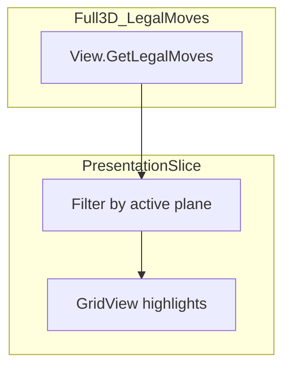

# Planning UX research

Notes on reference games, three design questions (plane slicing, keyboard step-commit, hex vs square), and how they apply to grim-space battle planning. Implementation lives on `feature/simple-preview`; rules stay in `src/battle/` and `src/core/`.

---

## Context: grim-space vs reference games

- Battle uses a **3D cell lattice** ([`Grid`](../../../src/math/grid/Grid.cs): `Width` × `Height` × `Depth`).
- Movement is **ship-relative 6-neighbor** steps ([`EStepDirection`](../../../src/battle/movement/enums/EStepDirection.cs)), not eight-way movement on a floor tile.
- Planning today: **mouse ray → legal endpoint `Option` → enqueue full path** ([`MovementSelection.PickOptionIndex`](../../../src/battle/presentation/ui/MovementSelection.cs), [`BattlePresenter.TryQueueMove`](../../../src/battle/presentation/ui/BattlePresenter.cs)).
- Camera: **WASD pans**, orbit/zoom; not used for discrete move steps ([`Controller`](../../../src/battle/presentation/camera/Controller.cs)).

---

## Reference games (online pointers)

| Reference | Terrain / 3D | Planning UX | Link |
|-----------|----------------|-------------|------|
| Into the Breach | 2D grid, elevation as tile state | Telegraph every tile effect before commit | [Steam](https://store.steampowered.com/app/590380/Into_the_Breach/) |
| Frozen Synapse | 3D view, **flat** logical space | Ghost trajectories, plan then commit | [Steam](https://store.steampowered.com/app/98200/Frozen_Synapse/) |
| XCOM 2 | **3D mesh + tile graph** | Path line, cover, overwatch cones | [Steam](https://store.steampowered.com/app/268500/XCOM_2/) |
| Chaos Gate: Daemonhunters | **3D + cell grid** | Range/move highlights on cells | [Steam](https://store.steampowered.com/app/1611910/Warhammer_40000_Chaos_Gate__Daemonhunters/) |
| BattleTech / Gloomhaven | Hex or hex-like, height | AP-limited path preview | [BattleTech on Steam](https://store.steampowered.com/app/637090/BATTLETECH/) |

**Observation:** Almost all marketed tactical planners show **terrain or a readable 2D slice** (floor, cover, height markers). Pure empty 3D volume is uncommon; they reduce dimensionality so overlays stay legible. That motivates **plane slicing** for preview (below) even when we use a **blank** backdrop instead of scenic terrain.

---

## 1. Slice move preview per plane

### Problem

In a full 3D volume, legal endpoints and paths overlap in projection. Highlights stack; depth makes picking ambiguous (“which cell did I hit?”). Reference games avoid this by **collapsing or slicing** space for the planning UI.

### Patterns (conceptual)

| Pattern | What the player sees | Analog |
|---------|----------------------|--------|
| **Active floor slice** | Only cells on one `Y` (or `Z`) layer highlighted; change layer with keys | Roguelike layer view; “deck” |
| **Working plane through ship** | Plane normal = dorsal/ventral; show in-plane neighbors plus forward/retro | Matches ship-relative 6-dir |
| **Column / lane focus** | Dim cells outside a thin slab around the actor | Less pick ambiguity |
| **Camera snap to plane** | Orbit locked so the grid reads like a flat board | XCOM, Chaos Gate |

### Fit for grim-space

- Rules remain fully 3D; a **presentation-only slice** does not change legality if highlights are filtered from existing [`Option.Path`](../../../src/battle/movement/Option.cs) and legal move search.
- Suggested first experiment: a **`PreviewPlane`** (or fixed axis)—e.g. highlight endpoint cells where `coord.Y == actor.Y`, but **always** show the actor cell and **committed/hover path** cells even when off-plane (so 3D paths do not vanish).
- Pair with a **blank / diagram backdrop** so the slice reads as a tactical overlay, not nebula ([`SpaceBackdrop`](../../../src/battle/presentation/graphics/SpaceBackdrop.cs)).

### Open decisions

- Which world axis is “deck” vs “vertical” in UI copy.
- Default plane: actor world `Y` vs plane derived from [`BodyFrame`](../../../src/battle/spatial/BodyFrame.cs) (dorsal normal).

---

## 2. Keyboard: move all directions, commit per step

### Proposal

Use the keyboard for **Forward / Retro / Port / Starboard / Dorsal / Ventral**, **one step at a time**, committing each step into the turn plan (or confirming before enqueue).

### Contrast with click-to-endpoint (current)

| | Click endpoint (current) | Keyboard per-step |
|--|--------------------------|-------------------|
| Mental model | “I want to end here” | “One thrust, then decide again” |
| Best for | Long paths, AP-optimized endpoints | Fine control, teaching, 3D disorientation |
| Risk | Wrong cell in depth | More bindings; slower long drifts |
| Rules hook | `TryEnqueueMovePath(Option)` | Repeated `TryEnqueue(MoveStepAction)` |

### Reference analogs

- **Roguelikes:** one key = one tile (sometimes with confirm).
- **Frozen Synapse / ITB:** pointer-heavy, but **undo** and **ghosts** make plans reversible—keyboard complements pointer.
- **Discrete 6DOF thrust:** grim-space already uses discrete steps; keys map cleanly to [`EStepDirection`](../../../src/battle/movement/enums/EStepDirection.cs).

### Suggested UX (future implementation)

- **Preview:** key press shows **one-step** legal directions from preview state.
- **Commit:** key again or **Enter** queues that step; **Backspace** undoes last plan action ([`TryUndoLast`](../../../src/battle/BattleOrchestrator.cs)).
- **Coexist with mouse:** keys for local steps; click for endpoint jumps when path search is available.
- While **`IsMovePathStarted`**, endpoint search is empty ([`View.GetLegalMoves`](../../../src/battle/presentation/planning/View.cs))—keyboard step mode aligns with **in-progress path** rules.

### Proposed bindings (draft, not implemented)

| Direction | Example keys (draft) |
|-----------|----------------------|
| Forward / Retro | W / S (when not panning camera) or I / K |
| Port / Starboard | A / D or J / L |
| Dorsal / Ventral | R / F or PgUp / PgDn |

Camera pan already uses WASD in hints; a **move mode** toggle or **hold modifier** may be required to avoid conflicts.

---

## 3. Why hexagons vs squares?

### Short answer

**Hex** grids give **equal adjacency** and **symmetric ranges** on a plane. **Square** grids (especially **3D voxels**) simplify indexing, axis-aligned ships, and box-shaped highlights. grim-space uses **square 3D cells + six ship-relative directions**—a cube lattice with directed face steps, not a hex map.

| | Hex (2D) | Square (2D/3D) |
|--|----------|----------------|
| Neighbors | 6, equal distance | 4 on a face (+ diagonals if allowed) |
| Distance / radius | Natural rings | Manhattan / Chebyshev rules |
| Diagonals | N/A | Cost 1 vs √2 design debates |
| 3D extension | 3D hex (~14 neighbors), rare | **Voxel cube**, standard |
| Tradition | Panzer General, tabletop BattleTech | XCOM, FFT-style tiles |

**Why references use hex:** wargame history, even arcs, no diagonal distance cheat.

**Why grim-space uses square 3D:** [`Coord`](../../../src/math/grid/Coord.cs) indexing, [`GridView`](../../../src/battle/presentation/graphics/GridView.cs) box highlights, **Fore / Dorsal / Starboard** aligned to cell faces.

**Preview implication:** Hex games often show **one ring** of moves; square 3D needs **plane slice** and/or **direction-colored paths** to avoid an unreadable blob of endpoints.

### Move planning v1: Manhattan rings (`feature/simple-preview`)

On this branch, move preview UX groups legal **Options** by Manhattan **shell** (**Ring** / **k**) from the planning actor **Position**, builds a **snapshot cache** once per preview frame, uses **Depthkey** (**Tab** / **Shift+Tab**) to change the active **ring**, and uses fast click plus **Raywalk** (hold) for near→far selection on that band only. Presentation-only—no rule changes. Vocabulary: [definitions.md](definitions.md), [CONTEXT.md](../../../CONTEXT.md).

---

## Recommended roadmap (preview-friendly)

1. **Blank / diagram backdrop** — reduce visual noise.
2. **Manhattan ring bands + Depthkey + Raywalk** — see [definitions.md](definitions.md) (this worktree); debug toggle among queue-hover, repick-at-click, or **fast click** select + **long click** queue.
3. **Plane slice filter on highlights** — legibility without rule changes (may combine with rings).
4. **Direction-colored path cells** — see `doc/battle/presentation-move-preview.md` on the **docs worktree** (`side-branches/docs-project-guides`, branch `docs/project-guides`).
5. **Optional keyboard single-step planning** — prototype alongside mouse.
6. **No hex migration** — document rationale (this file); stay on voxels.

---

## See also

- [preview-debug README](README.md) — index for this folder.
- Docs worktree: `doc/battle/presentation-move-preview.md` on branch `docs/project-guides`.
