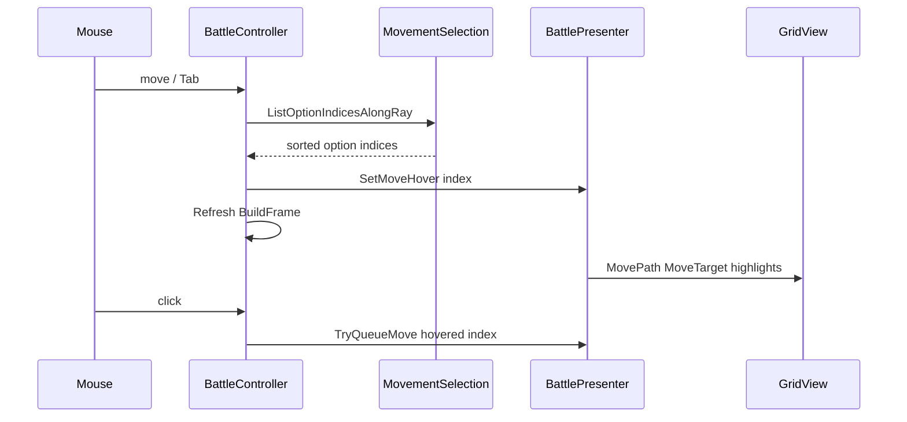

---
parentPlanPath: C:\Users\nadavcoh\.cursor\plans\cycle_hits_move_pick_3cd004dc.plan.md
planSlug: cycle-hits-move-pick
copiedAt: 2026-07-26T00:23:56+03:00
overview: On feature/simple-preview — blank diagram backdrop plus Tab/Shift+Tab cycle hits for move endpoint selection (presentation only).
branch: feature/simple-preview
editRoot: side-branches/preview-debug-friendly/side-branches/simple-preview
---

# Cycle hits + blank backdrop (simple-preview)

## Why this plan exists

Battle planning on a **64³** grid produces many legal move **endpoints**. In perspective, several endpoints **project onto the same screen direction**; the current picker chooses whichever endpoint is closest to the mouse ray in 3D perpendicular distance, which is often **not** the cell the player thinks they are pointing at. Separately, the **space nebula / fog / sun** backdrop reduces contrast on semi-transparent grid highlights.

This plan improves **readability** (blank diagram backdrop) and **selection** (cycle along the view ray with Tab) without changing rules, AP, or `View.GetLegalMoves`.

Research context: [planning-ux-research.md](../../planning-ux-research.md).

## Changed files

Paths are relative to this plan folder → edit root (`feature/simple-preview` worktree).

| File | Subplan |
|------|---------|
| [`src/battle/presentation/graphics/SpaceBackdrop.cs`](../../../../../src/battle/presentation/graphics/SpaceBackdrop.cs) | [subplans/src-battle-presentation-graphics-SpaceBackdrop.cs.plan.md](subplans/src-battle-presentation-graphics-SpaceBackdrop.cs.plan.md) |
| [`src/battle/presentation/graphics/RedDwarfSun.cs`](../../../../../src/battle/presentation/graphics/RedDwarfSun.cs) | [subplans/src-battle-presentation-graphics-RedDwarfSun.cs.plan.md](subplans/src-battle-presentation-graphics-RedDwarfSun.cs.plan.md) |
| [`src/battle/presentation/scene/BattleController.cs`](../../../../../src/battle/presentation/scene/BattleController.cs) | [subplans/src-battle-presentation-scene-BattleController.cs.plan.md](subplans/src-battle-presentation-scene-BattleController.cs.plan.md) |
| [`src/battle/presentation/ui/MovementSelection.cs`](../../../../../src/battle/presentation/ui/MovementSelection.cs) | [subplans/src-battle-presentation-ui-MovementSelection.cs.plan.md](subplans/src-battle-presentation-ui-MovementSelection.cs.plan.md) |
| [`src/battle/presentation/ui/BattlePresenter.cs`](../../../../../src/battle/presentation/ui/BattlePresenter.cs) | [subplans/src-battle-presentation-ui-BattlePresenter.cs.plan.md](subplans/src-battle-presentation-ui-BattlePresenter.cs.plan.md) |
| [`src/battle/presentation/ui/Combat.cs`](../../../../../src/battle/presentation/ui/Combat.cs) | [subplans/src-battle-presentation-ui-Combat.cs.plan.md](subplans/src-battle-presentation-ui-Combat.cs.plan.md) |
| [`grim-space.Tests/Presentation/RayOptionCycleTests.cs`](../../../../../grim-space.Tests/Presentation/RayOptionCycleTests.cs) *(new)* | [subplans/grim-space.Tests-Presentation-RayOptionCycleTests.cs.plan.md](subplans/grim-space.Tests-Presentation-RayOptionCycleTests.cs.plan.md) |

## Goals

1. **Blank diagram backdrop** — flat dark environment, no decorative meshes, fog off, neutral light so path/endpoint highlights dominate.
2. **Cycle hits** — when multiple legal endpoints lie near the same view ray, **Tab** / **Shift+Tab** cycles which endpoint is hovered (near → far along the ray). **Click queues the hovered endpoint**, not a fresh pick.

## Constraints

- **Presentation layer only** (`src/battle/presentation/`). Do not change `Simulation`, `MovePathFinder`, or legality.
- Keep **`SpaceBackdrop.Build`** and **`RedDwarfSun.Configure`** intact for merge to `feature/preview-debug-friendly` later (diagram mode is additive).
- Implement **backdrop first**, then ray cycling (immediate visual feedback in Godot).

## Architecture (data flow)

Today: `_Process` calls `PickOptionIndex` (single hit). After: build full hit list, track cursor, optional Tab cycle.

## Section index (see subplans per file)

| Section | Topic | Subplans |
|---------|--------|----------|
| 0 | Blank backdrop | SpaceBackdrop, RedDwarfSun, BattleController (_Ready) |
| 1 | Ray hit list | MovementSelection |
| 2–3 | Cycle + click | BattleController |
| 4 | Hints | Combat, BattlePresenter |
| 5 | Tests | RayOptionCycleTests |

---

## 0. Blank backdrop (presentation only)

### Problem

[`SpaceBackdrop.Build`](../../../../../src/battle/presentation/graphics/SpaceBackdrop.cs) adds nebula wisps, 700 stars, purple fog, and [`RedDwarfSun.CreateVisual`](../../../../../src/battle/presentation/graphics/RedDwarfSun.cs). [`RedDwarfSun.Configure`](../../../../../src/battle/presentation/graphics/RedDwarfSun.cs) tints the directional light red. Grid highlights use alpha blends; busy background **lowers effective contrast** and makes depth errors harder to see when debugging move paths on a large grid.

### Solution

- New **`BuildDiagram`**: single `WorldEnvironment` — solid background ~(0.07, 0.07, 0.09), **fog disabled**, neutral ambient gray.
- **`ConfigureNeutral`**: white key light, moderate energy, shadows off for v1 (diagram readability).
- **`BattleController._Ready`**: on this branch, call diagram build + neutral configure instead of cinematic `Build` + `Configure`.
- Keep **`Build`** / **`Configure`** unchanged so integration branch can restore space look via one call site or export toggle.

### Verification

Godot F5: no sun blob, no purple haze; blue/white/yellow grid tiles clearly visible.

Subplans: [SpaceBackdrop](subplans/src-battle-presentation-graphics-SpaceBackdrop.cs.plan.md), [RedDwarfSun](subplans/src-battle-presentation-graphics-RedDwarfSun.cs.plan.md), [BattleController § Part A](subplans/src-battle-presentation-scene-BattleController.cs.plan.md).

---

## 1. Ray hit list (pure logic)

### Problem

[`PickOptionIndex`](../../../../../src/battle/presentation/ui/MovementSelection.cs) returns one index with minimum perpendicular ray distance (`PickRadius = 1.4f`). When two or more endpoints align along the bore sight, picking is **ambiguous** and does not order targets by **depth along the view ray** (`t = dot(toPoint, direction)`).

### Solution

- **`ListOptionIndicesAlongRay`**: collect all options with perpendicular distance `< PickRadius`, sort by **`t` ascending**, then perpendicular distance, then option index (stable).
- **`PickOptionIndex`**: delegate to **first element** of that list (backward compatible default hover = nearest along ray).
- Camera overload: project screen point to origin + direction, then call vector overload.

### Verification

Unit tests with fixed origin/direction; no Godot. See [MovementSelection subplan](subplans/src-battle-presentation-ui-MovementSelection.cs.plan.md) and [RayOptionCycleTests subplan](subplans/grim-space.Tests-Presentation-RayOptionCycleTests.cs.plan.md).

---

## 2. Cycle state in BattleController

### Problem

Hover is updated every frame in `_Process` via `PickOptionIndex`, but there is **no memory** of which stacked endpoint the player chose when several share the same screen direction. Tab must advance a **cursor** into the pre-sorted hit list, not re-run ambiguous pick logic.

### Behavior (detailed)

**State (move mode only):**

- `_rayHitIndices` — output of `ListOptionIndicesAlongRay` for current mouse aim.
- `_rayHitCursor` — which element of that list is hovered (0 = nearest along ray).
- `_lastAimScreenPos` — last screen position used when the list was built (for stability).

**Each `_Process` frame (when in Move, not resolving, battle active):**

1. Rebuild `hits` from current mouse + `frame.MoveOptions`.
2. If mouse moved less than ~**2 px** from `_lastAimScreenPos` **and** the new `hits` sequence equals `_rayHitIndices`, **preserve** `_rayHitCursor` (clamped).
3. Otherwise reset **`_rayHitCursor = 0`**, store new list and aim position.
4. `SetMoveHover(hits[cursor], count)` or `null` if empty; refresh when index changes.

**Tab input (`_UnhandledInput`, Move mode only):**

- Rebuild hits from current mouse first.
- **Tab:** `(cursor + 1) % count`; **Shift+Tab:** `(cursor - 1 + count) % count`; no-op if `count <= 1`.
- Update hover + refresh; consume input so Tab does not focus UI elsewhere.

**Clear ray state** wherever move hover is cleared today: resolving, battle over, wrong mode, undo, heading/roll, successful move queue, leaving Move mode.

See [BattleController subplan](subplans/src-battle-presentation-scene-BattleController.cs.plan.md).

---

## 3. Click commits hover

### Problem

**Bug today:** `HandleLeftClick` (Move branch) calls **`PickOptionIndex` again** at click time. After the player cycles with Tab, hover shows option **B** but click may queue option **A** because pick uses click pixel and minimum perpendicular distance without the cycle cursor.

### Fix

Move click must use the **same index as hover**: read **`BattlePresenter.HoveredMoveIndex`** (or internal selection) and call **`TryQueueMove`** — **never** re-pick on click for Move mode.

See [BattlePresenter subplan](subplans/src-battle-presentation-ui-BattlePresenter.cs.plan.md).

---

## 4. Hint text

### Why

Cycle hits is keyboard-driven; without a hint, players assume the first visible path is the only target.

### Change

In **`CombatHints.BuildHint`**, **`EPlayerMode.Move`**: append  
**`Tab / Shift+Tab: cycle target along sight`**  
(after click-to-queue, before planning suffix).

Optional v1.1: pass `(hitIndex, hitCount)` and show **`target 2/5 along sight`** when count > 1.

See [Combat subplan](subplans/src-battle-presentation-ui-Combat.cs.plan.md).

---

## 5. Tests

### Why

Sort-by-`t` and `PickRadius` filtering are easy to break during refactors; they must not require Godot.

### Scope

New **`grim-space.Tests/Presentation/RayOptionCycleTests.cs`**:

1. **Sort order** — synthetic options on one ray → indices nearest → farthest.
2. **Radius** — endpoint outside `PickRadius` excluded.
3. **Tie-break** — equal `t` → smaller perpendicular distance, then lower index.

Run **`dotnet test`** from the simple-preview worktree.

See [RayOptionCycleTests subplan](subplans/grim-space.Tests-Presentation-RayOptionCycleTests.cs.plan.md).

---

## Manual test checklist

1. `.\open-godot.ps1 -Branch simple-preview` → editor → F5.
2. Backdrop flat; grid readable.
3. Aim at stacked endpoints; Tab cycles white hover tile; click queues that path.
4. `dotnet test` from worktree root.

---

## Out of scope

- Engagement camera default, depth band / Y-layer slicing, direction-colored paths (later plans).
- Cycle for missile/flak/railgun.
- Merging full backdrop into integration branch (use export toggle later).

---

## Subplans

Implementation detail per file: [index.md](index.md) → `subplans/`.
