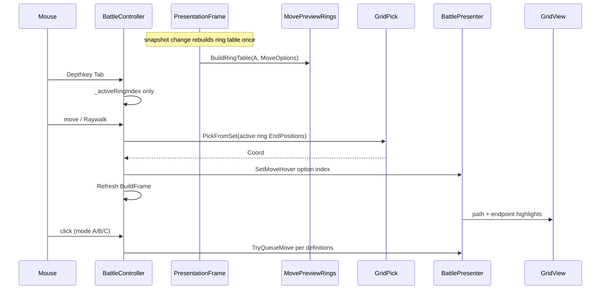

# Manhattan rings + blank backdrop (simple-preview)

**Glossary:** [definitions.md](../../definitions.md) · [CONTEXT.md](../../../../../CONTEXT.md)

**Supersedes:** primary UX based on **`ListOptionIndicesAlongRay`** / “cycle along sight ray” (legacy [cycle_hits_move_pick](file:///%USERPROFILE%/.cursor/plans/cycle_hits_move_pick_3cd004dc.plan.md)).

## Why this plan exists

Battle planning on a **64³** grid produces many legal move **endpoints**. Picking among all **Options** with a single ray-distance heuristic is ambiguous when endpoints stack in depth. **Manhattan rings** narrow choices to one shell **k** at a time (**Depthkey**). On the active **ring**, **`GridPick.PickFromSet`** chooses the **EndPosition** **cell** closest to the pointer; optional **Raywalk** scrubs near?far along the view on that band.

Separately, the **space nebula / fog / sun** backdrop reduces contrast on semi-transparent grid highlights — **diagram backdrop** fixes readability.

Research: [planning-ux-research.md](../../planning-ux-research.md).

## Changed files

Paths relative to this plan folder ? edit root.

| File | Subplan |
|------|---------|
| [`SpaceBackdrop.cs`](../../../../../src/battle/presentation/graphics/SpaceBackdrop.cs) | [subplans/src-battle-presentation-graphics-SpaceBackdrop.cs.plan.md](subplans/src-battle-presentation-graphics-SpaceBackdrop.cs.plan.md) |
| [`Lighting.cs`](../../../../../src/battle/presentation/graphics/Lighting.cs) | [subplans/src-battle-presentation-graphics-Lighting.cs.plan.md](subplans/src-battle-presentation-graphics-Lighting.cs.plan.md) |
| [`PointMapping.cs`](../../../../../src/battle/presentation/PointMapping.cs) | [subplans/src-battle-presentation-PointMapping.cs.plan.md](subplans/src-battle-presentation-PointMapping.cs.plan.md) |
| [`GridPick.cs`](../../../../../src/battle/presentation/picking/GridPick.cs) | [subplans/src-battle-presentation-picking-GridPick.cs.plan.md](subplans/src-battle-presentation-picking-GridPick.cs.plan.md) |
| [`MovePreviewRings.cs`](../../../../../src/battle/presentation/ui/MovePreviewRings.cs) *(new)* | [subplans/src-battle-presentation-ui-MovePreviewRings.cs.plan.md](subplans/src-battle-presentation-ui-MovePreviewRings.cs.plan.md) |
| [`BattlePresenter.cs`](../../../../../src/battle/presentation/ui/BattlePresenter.cs) | [subplans/src-battle-presentation-ui-BattlePresenter.cs.plan.md](subplans/src-battle-presentation-ui-BattlePresenter.cs.plan.md) |
| [`BattleController.cs`](../../../../../src/battle/presentation/scene/BattleController.cs) | [subplans/src-battle-presentation-scene-BattleController.cs.plan.md](subplans/src-battle-presentation-scene-BattleController.cs.plan.md) |
| [`MovementSelection.cs`](../../../../../src/battle/presentation/ui/MovementSelection.cs) | [subplans/src-battle-presentation-ui-MovementSelection.cs.plan.md](subplans/src-battle-presentation-ui-MovementSelection.cs.plan.md) |
| [`Combat.cs`](../../../../../src/battle/presentation/ui/Combat.cs) | [subplans/src-battle-presentation-ui-Combat.cs.plan.md](subplans/src-battle-presentation-ui-Combat.cs.plan.md) |
| [`MovePreviewRingTests.cs`](../../../../../grim-space.Tests/Presentation/MovePreviewRingTests.cs) *(new)* | [subplans/grim-space.Tests-Presentation-MovePreviewRingTests.cs.plan.md](subplans/grim-space.Tests-Presentation-MovePreviewRingTests.cs.plan.md) |

## Goals

1. **Blank diagram backdrop** — flat dark environment, neutral light (unchanged from v0 plan).
2. **Manhattan rings** — snapshot **ring table** when preview **Position** **A** or **`MoveOptions`** change; **Depthkey** changes active **ring** only (no rebuild).
3. **Hover** — on active ring: dedupe one **Option** per **EndPosition**; pick closest **cell** via **`GridPick.PickFromSet`**; **Raywalk** for near?far on that band.
4. **Click** — playtest **debug modes** **A / B / C** per [definitions.md § Click](../../definitions.md#click-target-vs-today); ship one after playtest (mode **C**: **fast click** select on **Raywalk**, **long click** queue).

## Constraints

- **Presentation only** — no simulation / legality changes.
- Keep **`SpaceBackdrop.Build`** / **`Lighting.ConfigureCinematic`** for integration branch.
- **No** full-grid distance LUT; **snapshot option cache** only.
- **Do not** add **`ListOptionIndicesAlongRay`** as primary Tab model.

## Architecture (data flow)

Today: `_Process` uses **`PickOptionIndex`** over all options; click re-picks. After: ring-filtered set + stable snapshot cache.

## Section index

| Section | Topic | Subplans |
|---------|--------|----------|
| 0 | Blank backdrop | SpaceBackdrop, Lighting, BattleController (_Ready) |
| 1 | World ? grid | PointMapping, GridPick |
| 2 | Snapshot ring table | MovePreviewRings, BattlePresenter |
| 3 | Depthkey + hover + Raywalk | BattleController, MovementSelection (helpers only) |
| 4 | Hints + hover accessor | BattlePresenter, Combat |
| 5 | Tests | MovePreviewRingTests |

---

## 0. Blank backdrop (presentation only)

**`BuildDiagram`**, **`Lighting.ConfigureDiagram`**, **`BattleController._Ready`** wiring. See subplans for SpaceBackdrop, Lighting, BattleController Part A.

**Verification:** F5 — flat void; grid readable.

---

## 1. World ? grid boundary

### Problem

**`GridPick`** uses private **`WorldToCell`**. Move ring hover needs the same **Coord** rule as missile/flak picking, documented in one place.

### Solution

- Public **`PointMapping.ToCoord(Vector3)`** — match today’s floor/`CellSize` rule in `GridPick.WorldToCell`.
- **`GridPick`** delegates **`WorldToCell`** ? **`PointMapping.ToCoord`**.

**Verification:** build; picking behavior unchanged for existing modes.

---

## 2. Snapshot ring table

### Problem

Filtering **Options** by Manhattan **k** on every frame is wasteful and makes Tab feel unstable if grouping changes under the cursor.

### Solution

- New **`MovePreviewRings.BuildRingTable(Coord actor, IReadOnlyList<Option> options)`** ? **`MovePreviewRingTable`**:
  - **`ShellKValues`**: sorted **k** with =1 deduped endpoint (skip empty shells).
  - **`OptionIndicesOnRing(ringIndex)`**: pre-grouped indices; dedupe **one Option per EndPosition** (lowest **`ApCost`**, then index).
- Attach table to **`PresentationFrame`** in **`BattlePresenter.BuildFrame`** when **A** or **`MoveOptions`** change.
- Controller keeps **`_activeRingIndex`**; clamp/reset on snapshot change.

**Verification:** unit tests (§5); Tab does not rebuild table.

Design rationale (Manhattan vs ray-list): [definitions.md](../../definitions.md) + rings full plan § Design reasoning.

---

## 3. Depthkey, hover, Raywalk, click

### Depthkey

**Tab** / **Shift+Tab**: increment **`_activeRingIndex`** over **`ShellKValues.Count`** — no table rebuild.

### Hover

Build **`IReadOnlySet<Coord>`** (or equivalent) from deduped **EndPosition**s on active ring ? **`GridPick.PickFromSet`** ? map **Coord** to **Option** index ? **`SetMoveHover`**.

### Raywalk

While held, scrub selection near?far along view **on active ring only** (implementation detail in BattleController subplan; may reuse ray **`t`** sort among ring endpoints).

### Click

Per [definitions.md](../../definitions.md):

- **A** — queue **`HoveredMoveIndex`**
- **B** — **`PickOptionIndex`** at click (today)
- **C** — **fast click** pins selection during **Raywalk**; **long click** queues

**Debug export** or dev toggle to switch modes during playtest.

### MovementSelection

**Do not** implement **`ListOptionIndicesAlongRay`** as primary UX. Keep **`PickOptionIndex`** for mode **B** and legacy paths until removed. Optional small ray-sort helper for **Raywalk** only.

---

## 4. Hint text

Move mode hints:

- **`Tab / Shift+Tab: cycle ring`** (**Depthkey**)
- Optional: **`Ring i/n (k=…)`** when presenter exposes ring accessors
- **Raywalk** / click modes: short line or dev-only hint when debug toggle visible

See Combat subplan.

---

## 5. Tests

**`MovePreviewRingTests.cs`** (no Godot):

- Shell grouping and sorted **k**
- Dedupe by **EndPosition**
- Empty options / single ring
- Skip empty **k** shells

**Not in scope:** ray-list sort tests (retired).

---

## Manual test checklist

1. `.\open-godot.ps1 -Branch simple-preview` ? F5.
2. Diagram backdrop; grid readable.
3. **Depthkey** changes which endpoints are eligible; hover follows closest **cell** on ring.
4. **Raywalk** scrubs on active ring; click modes **A/B/C** per debug toggle.
5. `dotnet test` from worktree root.

---

## Out of scope

- Full-grid ring dimming in **GridView**
- Chebyshev / inclusive cubes
- **`ListOptionIndicesAlongRay`** primary Tab model
- Rules / **`GetLegalMoves`** changes

---

## Subplans

Per-file steps: [index.md](index.md) ? `subplans/`.
