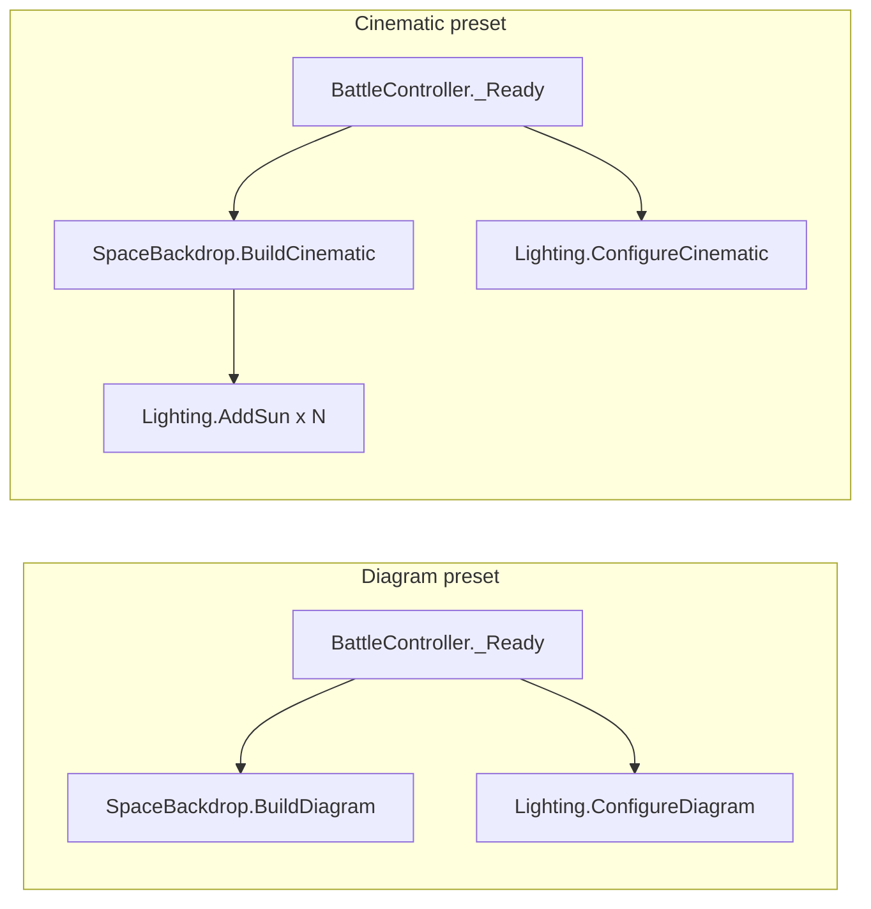

# Lighting + AddSun refactor

## Goals

1. Rename **`RedDwarfSun`** → **`Lighting`** with preset method names **`ConfigureDiagram`** / **`ConfigureCinematic`** (not “neutral” / “Configure”).
2. Replace **`CreateVisual`** with **`AddSun(parent, gridCenter, chamberRadius)`** — parents one emissive sun prop; call multiple times for multiple suns later.
3. Rename **`SpaceBackdrop.Build`** → **`BuildCinematic`**; diagram path stays **`BuildDiagram`**.
4. **`BattleController._Ready`** uses diagram preset + **`ConfigureDiagram`** (fixes today’s mismatch: diagram backdrop + warm **`RedDwarfSun.Configure`**).

## Architecture

| Concern | Owner | Diagram | Cinematic |
|---------|--------|---------|-----------|
| Fog, nebula, starfield | `SpaceBackdrop` | skipped | `BuildCinematic` |
| Sun mesh props | `Lighting.AddSun` | not called | 1× (or N×) |
| Scene `DirectionalLight3D` | `Lighting.Configure*` | `ConfigureDiagram` | `ConfigureCinematic` |

One scene directional light; `AddSun` is decorative geometry aligned to shared key direction (today’s `LightDirection`).

## Changed files

Paths relative to edit root; links from this folder use `../../../../../` prefix.

| File | Subplan |
|------|---------|
| [`src/battle/presentation/graphics/Lighting.cs`](../../../../../src/battle/presentation/graphics/Lighting.cs) *(replaces RedDwarfSun.cs)* | [subplans/src-battle-presentation-graphics-Lighting.cs.plan.md](subplans/src-battle-presentation-graphics-Lighting.cs.plan.md) |
| [`src/battle/presentation/graphics/SpaceBackdrop.cs`](../../../../../src/battle/presentation/graphics/SpaceBackdrop.cs) | [subplans/src-battle-presentation-graphics-SpaceBackdrop.cs.plan.md](subplans/src-battle-presentation-graphics-SpaceBackdrop.cs.plan.md) |
| [`src/battle/presentation/scene/BattleController.cs`](../../../../../src/battle/presentation/scene/BattleController.cs) | [subplans/src-battle-presentation-scene-BattleController.cs.plan.md](subplans/src-battle-presentation-scene-BattleController.cs.plan.md) |

## Naming notes

- Prefer **`AddSun`** over **`AddStar`** — `SpaceBackdrop` already has **`CreateStarfield`** (700 background instances).
- No **`Battle`** prefix on type names; path is already under `battle/presentation/graphics/`.
- No registry or “count suns in scene”; composition calls **`AddSun`** as needed.

## Optional v1.1

`[Export] bool UseDiagramBackdrop` on `BattleController` to switch `BuildDiagram`/`BuildCinematic` and matching `Configure*` without duplicating scenes.

## Optional follow-up

Update [`cycle-hits-move-pick`](../cycle-hits-move-pick/index.md) subplans that still say `RedDwarfSun` / `ConfigureNeutral` to match `Lighting` / `ConfigureDiagram`.

## Out of scope

- Moving nebula/starfield into `Lighting`
- Second fill light, HDRI, environment probes
- Ray-cycle / Tab UX (see cycle-hits-move-pick plan)

## Verification (full)

See [index.md](index.md) suggested order. After all subplans:

- `dotnet build` from edit root
- Godot F5: diagram — no sun blob, neutral grid read; temporarily swap to cinematic — sun prop + warm light, direction matches prop
